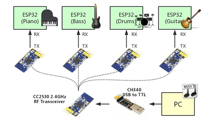
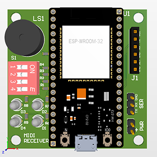

# IPD 516 final project (MIDI & Sync Team)
Zheyuan Xie, Peng Li

## Overview


## Software
### Dependency
 - pyserial
 - mido
 - remi
 
You can install these packages using pip:
```
pip install pyserial mido remi
```

## Hardware
 - The transmitter module connected to PC sends MIDI bytes to four receiver modules.
 - The receiver modules process the bytes and communicate with the machatronic instrument through a TTL serial interface.

MIDI Transmitter PCB          |  MIDI Receiver PCB
:-------------------------:|:-------------------------:
      |  

## Instruction for Instrument Teams
As a musical instrument team, you will get a receiver module. You should connect the UART2 port (or another UART port) of your ESP32 to the SER connector (3 male header pins on the right side of the receiver module).

The code that runs on your ESP32 should be derived from `insturment_template.ino`. The four functions you will need to implement are:
 - `init_inst`: Initialize your instrument, run only once when system boots.
 - `note_on`: The response to a MIDI NOTE_ON message. Do not use blocking functions like `delay()` here.
 - `note_off`: The response to a MIDI NOTE_OFF message. Instrument that does not sustain need not to implement this function.
 - `expected_delay`: This function calculates the expected delay between executing the `note_on` and actually generating sound. It can be a constant or a function of note, velocity, and previous note played, depending on the type of your instrument.

The MIDI receiver module issues commands in real time, but in `instrument_template.ino`, each note is delayed `GLOBAL_DELAY - expected_delay()` microseconds to trigger the `note_on` function. The default value of `GLOBAL_DELAY` is **3 seconds**, which should give you enough time to prepare the actuator. Therefore the `expeteced_delay()` should not return a value larger than the `GLOBAL_DELAY`.

### Test your code with MIDI Receiver PCB using USB Serial
For instrument team who want to test their code that derived from `insturment_template.ino`, you should
- Upload `receiver_test.ino` to the ESP32 that will mount on the MIDI Receiver PCB;
- Connect your ESP32 to receiver ESP32;
- Set DIP switch *1* ON to receive message via USB serial;
- Set DIP switch *2* ON to turn the buzzer ON.

Instrument ESP32 | Receiver ESP32
:-----------------:|:----------------:
RX   |TX
TX   |RX
GND|GND
- Connect receiver ESP32 to your computer COM port
- Download `sender` folder and run the python code `main.py` 
- Choose the serial COM Port that receiver ESP32 connects to
- Choose the song that you would like to play
- Map channels as you desired, for example `2:0,9:9` means map MIDI channel 3 to instrument channel 0 and map MIDI channel 10 to instrument channel 9, this also means that only MIDI events from MIDI channel 3 and channel 10 are sent. If you want MIDI messages from all channel to be received, you need to write `0:0,1:1,2:2,3:3,4:4,5:5,6:6,7:7,8:8,9:9,10:10,11:11,12:12,13:13,14:14,15:15`. You can also map 2 or more channel to one channel, `0:0, 2:0` maps MIDI channel 1 and 3 to instrument channel 0.

Now when you hit the start button, the receiver ESP32 should get MIDI events via USB serial and should send MIDI events of channel selected by DIP switch to your instrument ESP32. DIP switch *3* is the most significant bit and *4* is the least significant bit. If *3* is *on*, then instrument channel 2 is selected. If *4* is on, then instrument channel 1 is selected. If *3* and *4* are both on, then instrument channel 3 is selected.
